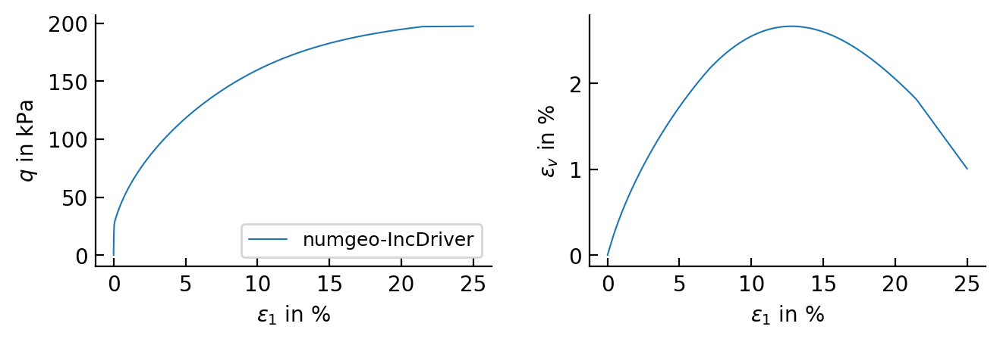

# Examples

Two ready-to-run examples are shipped in `examples/`, each with its pre-built executable already
sitting next to its input files.

```
examples/
├── IncrementalDriver/     → IncrementalDriver.exe + input files + pre-computed results
└── Calibration/           → numgeo-hs-bricks-calibration.exe + parameters.inp
```

## Incremental-driver example

`examples/IncrementalDriver/` contains a drained (CD) triaxial compression test on the glacial
till parameters of Cudny &amp; Truty (2020), Eq. 44 — the same parameters documented in
[Incremental driver](components/incremental-driver.md#input-files): isotropic start at
$-100\,\text{kPa}$, axial strain driven to $-25\,\%$ over 5000 increments, radial stress held
constant.

To run it yourself:

```
cd examples\IncrementalDriver
IncrementalDriver.exe
```

The driver reads `parameters.inp`, `initialconditions.inp` and `test.inp` from the current
directory (these fixed file names are hard-coded in the driver) and writes the result to
`output_CD.out`, overwriting the pre-computed copy shipped here. No console output needs to be
read afterwards, so — unlike the calibration tool below — running this by double-clicking the
`.exe` in Explorer is fine.

`triax_CD.py` (Python, needs `pandas` and `matplotlib`) plots `output_CD.out`:

```
python triax_CD.py
```

producing `triax_CD.png`/`triax_CD.pdf`:

<figure class="hsb-fig-wrap" markdown>
{ .hsb-fig }
<figcaption>
Drained (CD) triaxial compression, glacial till parameters (Cudny &amp; Truty 2020, Eq. 44):
deviatoric stress <em>q</em> and volumetric strain <em>ε<sub>v</sub></em> against axial strain
<em>ε<sub>1</sub></em>.
</figcaption>
</figure>

## Calibration example

`examples/Calibration/` contains the same glacial-till parameters, but with `alpha = Hpp = 0` in
`parameters.inp` — i.e. an *uncalibrated* input, ready to be fed straight into the calibration
tool.

!!! danger "Run this from the command prompt"
    As emphasised on the [Calibration tool](components/calibration.md) page: double-clicking
    `numgeo-hs-bricks-calibration.exe` closes the window before you can read the printed result.
    Open a command prompt first:

    ```
    cd examples\Calibration
    numgeo-hs-bricks-calibration.exe
    ```

    When prompted, enter:

    ```
    parameters.inp
    ```

    The tool prints:

    ```
    Calibration complete:
      alpha (props(13)) =   5.14549145E-01
      Hpp   (props(14)) =   9.86591189E+03
    ```

    — which are exactly the `alpha`/`Hpp` values already used in
    `examples/IncrementalDriver/parameters.inp`, confirming the two examples are consistent with
    each other.
