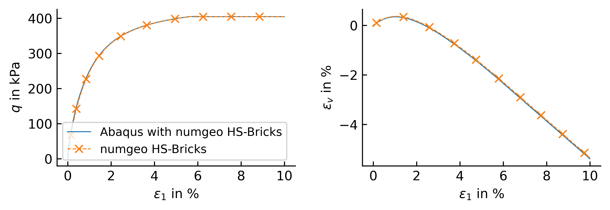
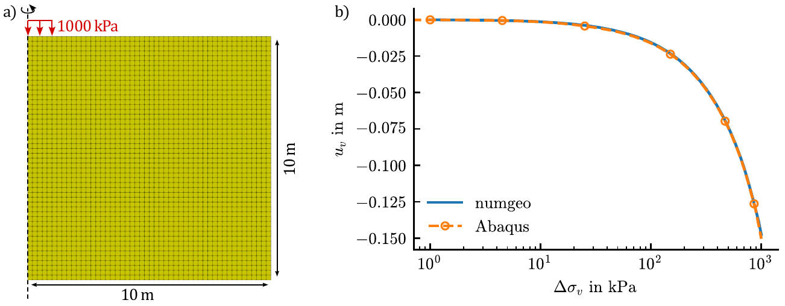

# Examples

Four ready-to-run examples are shipped in `examples/`: two standalone examples with pre-built
executables and two Abaqus/UMAT examples, comprising a single-element test and an axisymmetric
circular shallow-foundation boundary-value problem.

```
examples/
├── IncrementalDriver/     → IncrementalDriver.exe + input files + pre-computed results
├── Calibration/           → numgeo-hs-bricks-calibration.exe + parameters.inp
└── umat/
    ├── element test/      → triax-hs-bricks.inp + comparison data
    └── circular footing/
        └── circular-footing - Kopie/ → input-abaqus.inp + run.bat
```

---

## Incremental-driver example

`examples/IncrementalDriver/` contains a drained (CD) triaxial compression test on the glacial
till parameters of Cudny &amp; Truty (2020), Eq. 44 — the same parameters documented in
[Incremental driver](components/incremental-driver.md#input-files): isotropic start at
$-100\,\text{kPa}$, axial strain driven to $-25\,\%$ over 5000 increments, radial stress held
constant.

To run it yourself:

```
cd examples\IncrementalDriver
IncrementalDriver.exe
```

The driver reads `parameters.inp`, `initialconditions.inp` and `test.inp` from the current
directory (these fixed file names are hard-coded in the driver) and writes the result to
`output_CD.out`, overwriting the pre-computed copy shipped here. No console output needs to be
read afterwards, so — unlike the calibration tool below — running this by double-clicking the
`.exe` in Explorer is fine.

`triax_CD.py` (Python, needs `pandas` and `matplotlib`) plots `output_CD.out`:

```
python triax_CD.py
```

producing `triax_CD.png`/`triax_CD.pdf`:

<figure class="hsb-fig-wrap" markdown>
{ .hsb-fig }
<figcaption>
Drained (CD) triaxial compression, glacial till parameters (Cudny &amp; Truty 2020, Eq. 44):
deviatoric stress <em>q</em> and volumetric strain <em>ε<sub>v</sub></em> against axial strain
<em>ε<sub>1</sub></em>.
</figcaption>
</figure>

---

## Calibration example

`examples/Calibration/` contains the same glacial-till parameters, but with `alpha = Hpp = 0` in
`parameters.inp` — i.e. an *uncalibrated* input, ready to be fed straight into the calibration
tool.

!!! danger "Run this from the command prompt"
    As emphasised on the [Calibration tool](components/calibration.md) page: double-clicking
    `numgeo-hs-bricks-calibration.exe` closes the window before you can read the printed result.
    Open a command prompt first:

    ```
    cd examples\Calibration
    numgeo-hs-bricks-calibration.exe
    ```

    When prompted, enter:

    ```
    parameters.inp
    ```

    The tool prints:

    ```
    Calibration complete:
      alpha (props(13)) =   5.14542433E-01
      Hpp   (props(14)) =   9.86724062E+03
      convergence history = hs_internal_constants_convergence.csv
    ```

    The convergence CSV can be plotted with `scripts/plot_hs_internal_optimization_history.py`;
    see the [Calibration tool](components/calibration.md) page for the columns and command line.

    These values are consistent with the rounded `alpha`/`Hpp` values used in
    `examples/IncrementalDriver/parameters.inp`.

---

## UMAT example

`examples/umat/element test/triax-hs-bricks.inp` is a complete, working Abaqus input deck for the UMAT
interface: a single axisymmetric `CAX4R` element (reduced integration, with hourglass control),
a step named "Geostatic" (using `*Static`) that establishes the initial stress state, followed by
a drained triaxial compression step driving the top boundary to $-10\,\%$ axial strain. Here is
how to run it, step by step.

**1. Copy the constitutive implementation.** Copy the whole `src/numgeo-hs-bricks/` folder into
the directory where you will run the Abaqus job, keeping it as a subfolder named exactly
`numgeo-hs-bricks`. These three files *are* the model — everything else in this example is
plumbing around them:

| File | Task |
|---|---|
| `precision_.f90` | Defines the real/integer kinds used throughout. |
| `compatibility_numgeo_.f90` | Stress-invariant and small linear-algebra helper routines the constitutive routine needs. |
| `numgeo_hardening_soil_MN_bricks_.f90` | The constitutive routine itself — identical to the one called by the incremental driver and by numgeo directly. |

**2. Copy the three UMAT files** from `src/hs-bricks-umat/` into the *same* directory (as
siblings of the `numgeo-hs-bricks` subfolder, not inside it):

| File | Task |
|---|---|
| `user.for` | The file you actually point Abaqus at. It does no work itself — it just `INCLUDE`s the five files above and below it, in the right order, so Abaqus only has to be told about one file. |
| `umat.f90` | The actual `subroutine umat(...)`: translates Abaqus' calling convention (stress/strain arrays, `NTENS`, `KINC`, ...) into a call to `hardening_soil_MN_bricks` in the constitutive module, and translates the result back. |
| `sdvini.f90` | Implements Abaqus' `SDVINI` hook, used in this example to set the initial preconsolidation stress `statev(3)` before the analysis starts — see [UMAT (Abaqus) interface: sdvini.f90](components/umat.md#sdvinif90-initialising-state-variables). |

**3. Copy the input deck**, `examples/umat/element test/triax-hs-bricks.inp`, into the same directory.

You should now have:

```
your-abaqus-working-directory/
├── triax-hs-bricks.inp
├── user.for
├── umat.f90
├── sdvini.f90
└── numgeo-hs-bricks/
    ├── precision_.f90
    ├── compatibility_numgeo_.f90
    └── numgeo_hardening_soil_MN_bricks_.f90
```

**4. Set the `/free` compiler flag** in your Abaqus environment file, so that `user.for` compiles
as free-form Fortran despite its `.for` extension — see
[UMAT (Abaqus) interface: compiler settings](components/umat.md#abaqus-compiler-settings-free-form-fortran)
for exactly where this goes for your Abaqus version. This only needs to be done once per
installation, not once per job.

**5. Run the job** from that directory:

```
abaqus inp=triax-hs-bricks user=user
```

No `job=` is given, so Abaqus names the job after the input file, `triax-hs-bricks` — you will get
`triax-hs-bricks.dat`, `.odb`, `.msg`, etc. The stress/strain history requested by the deck's
`*El Print` lines is written to the `.dat` file.

### Comparing the UMAT result against numgeo

The same test run through Abaqus/UMAT and through native numgeo, with identical parameters and
loading, agree closely:

<figure class="hsb-fig-wrap" markdown>
{ .hsb-fig }
<figcaption>
Drained triaxial compression to -10% axial strain: Abaqus (via the UMAT interface) against
native numgeo, for identical parameters and loading.
</figcaption>
</figure>

`examples/umat/element test/` ships everything behind this figure: `abaqus-result.dat` (the result of the run
above), `numgeo-result.dat` (the same test run through numgeo directly), and `triax_CD.py`, the
script that reads both and produces this plot. See
[UMAT (Abaqus) vs. numgeo](validation/umat-vs-numgeo.md) for the quantified agreement and what
this comparison does and doesn't validate.

### Axisymmetric circular shallow-foundation example

A second Abaqus example exercises the UMAT in a non-uniform boundary-value problem rather than a
single element. The model is an axisymmetric circular foundation with radius $1\,\mathrm{m}$ on a
$10\,\mathrm{m}\times10\,\mathrm{m}$ soil domain, discretised with structured `CAX8` elements. After
a geostatic gravity step, a uniform footing pressure is ramped to $1000\,\mathrm{kPa}$.

<figure class="hsb-fig-wrap" markdown>
{ .hsb-fig }
<figcaption>
Axisymmetric circular shallow foundation: model geometry and footing-centre pressure-settlement
response from native numgeo and Abaqus/UMAT.
</figcaption>
</figure>

The Abaqus and numgeo curves are practically coincident over the complete common loading path.
This benchmark therefore extends the material-point interface check above to repeated UMAT calls
at spatially varying stress states within a global finite-element equilibrium problem.

The files are available directly in the repository:

- [`input-abaqus.inp`](https://github.com/j-machacek/numgeo-hardening-soil-bricks/blob/HEAD/examples/umat/circular%20footing/circular-footing%20-%20Kopie/input-abaqus.inp)
- [`run.bat`](https://github.com/j-machacek/numgeo-hardening-soil-bricks/blob/HEAD/examples/umat/circular%20footing/circular-footing%20-%20Kopie/run.bat)
- [:octicons-file-directory-16: complete circular-footing example folder](https://github.com/j-machacek/numgeo-hardening-soil-bricks/tree/HEAD/examples/umat/circular%20footing/circular-footing%20-%20Kopie){ target="_blank" }

For the complete model description and interpretation, see
[Axisymmetric circular shallow foundation](validation/circular-shallow-foundation.md).

