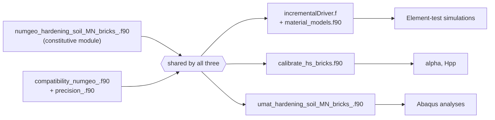

# numgeo-hardening-soil-bricks { .hsb-center }

  

A standalone Fortran implementation of the **Hardening Soil (Matsuoka-Nakai, Bricks)**
constitutive model — the Hardening Soil model with a Matsuoka–Nakai failure surface and the
**BRICK small-strain stiffness extension** of Cudny &amp; Truty (2020). Extracted from
<a href="https://www.numgeo.de/" target="_blank">numgeo</a> and packaged for element testing,
calibration and Abaqus/UMAT use.

[Components overview](components/index.md){ .md-button .md-button--primary }
[Theory](theory.md){ .md-button }
[Building the code](building.md){ .md-button }
[Examples](examples.md){ .md-button }

## Three things are shipped

This repository packages the same, unmodified constitutive module three different ways, so you
can use it in whichever environment fits your workflow:

### :material-play-box-outline: Incremental driver
Element tests 
A ready-to-use build of A. Niemunis' famous **incrementalDriver**, for quick, single-element
simulations of laboratory tests (oedometer, triaxial, ...) without setting up a full boundary-value
problem.  
[:octicons-arrow-right-16: Details](components/incremental-driver.md)

### :material-tune-variant: Calibration tool
alpha &amp; Hpp 
A small helper program that calibrates the model's internal cap constants `alpha` and `Hpp`
from the primary material parameters — especially helpful when using the model in **Abaqus**,
where automatic calibration inside the material routine is not available.  
[:octicons-arrow-right-16: Details](components/calibration.md)

### :material-cube-outline: UMAT (Abaqus) interface
Abaqus 
A minimal, self-contained **UMAT** library — just four Fortran files — that plugs the model
straight into an Abaqus user-material build, with no dependency on the driver or example
infrastructure.  
[:octicons-arrow-right-16: Details](components/umat.md)

## How the pieces fit together

All three tools link the same two files: the constitutive module itself and a small
compatibility layer that supplies the stress-invariant and matrix helper routines it needs.
Nothing in the constitutive model differs between the three — only the surrounding driver code
that calls it does.

## Theory

The full theoretical background — stress measures, the Matsuoka–Nakai shear cone, the
elliptical cap, the BRICK small-strain formulation, hardening laws and the internal
calibration procedure — is documented on the numgeo documentation site and is **not** repeated
here.

!!! abstract "Theory & equations"
    [:octicons-book-16: Hardening Soil (MN, Bricks) — theory manual](https://j-machacek.github.io/numgeo/theory/constitutive-models/mechanical-models/hardening-soil-MN-bricks.html){ target="_blank" }

    See the [Theory](theory.md) page for a short orientation, and [Model parameters](parameters.md)
    for how the theory's symbols map onto the `props`/`statev` arrays used by the code in this
    repository.

## Development

### Developed for numgeo
This implementation is a development of **Jan Machaček**, **Leonardo José Cocco** and
**Marcin Cudny**, developed for and derived from the free finite-element software
<a href="https://www.numgeo.de/" target="_blank">numgeo</a>.  
[:octicons-link-external-16: numgeo website](https://www.numgeo.de/) ·
[:octicons-book-16: numgeo docs](https://j-machacek.github.io/numgeo/)

### Get in touch
Questions, issues or feedback are welcome — see [About &amp; contact](about.md) for details.  
[:octicons-arrow-right-16: About &amp; contact](about.md)

