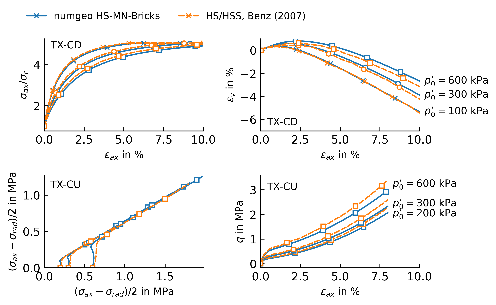

# Base model vs. Benz (2007)

This example validates the base Hardening Soil (Matsuoka&ndash;Nakai) mechanism with the BRICK
small-strain extension deactivated, by back-calculating six element tests from Benz's
dissertation&nbsp;[3]: three drained (TX-CD) and three undrained (TX-CU) triaxial compression
tests at different initial mean effective stresses $p_0'$.

---

## Parameters

Dense Hostun sand (stiffnesses and stresses in kPa):

| $E_{50}^{ref}$ | $E_{oed}^{ref}$ | $E_{ur}^{ref}$ | $m$ | $c$ | $\varphi$ | $\psi$ | $\nu_{ur}$ |
|---|---|---|---|---|---|---|---|
| 30\,000 | 30\,000 | 90\,000 | 0.55 | 0 | $42^\circ$ | $16^\circ$ | 0.25 |

| $p_{ref}$ | $K_0^{nc}$ | $R_f$ | $E_i^{ref}$ | $\alpha$ | $H_{pp}$ | $\gamma_{0.7}$ | $G_0^{ref}$ |
|---|---|---|---|---|---|---|---|
| 100 | 0.4 | 0.9 | 65\,000 | 1.46 | 72\,000 | negligible (e.g. $10^{-6}$) | 108\,000 |

!!! note "Isolating the base mechanism"
    $\gamma_{0.7}$ is set to a negligible value here specifically to **deactivate** the BRICK
    extension, exactly as the corresponding comparisons in Benz's own dissertation do, so that
    this example isolates the base HS-MN mechanism on its own. See
    [BRICK extension vs. ZSoil](hs-mn-bricks-zsoil.md) for the small-strain extension itself, and
    [Model parameters](../parameters.md) for how $\gamma_{0.7} = G_0^{ref}/G_{ur}^{ref}$
    degenerates the model exactly to the base model.

---

## Result

<figure class="hsb-fig-wrap" markdown>
{ .hsb-fig }
<figcaption>
Drained (TX-CD) and undrained (TX-CU) triaxial compression: stress ratio and volumetric strain (drained), effective
stress path and deviatoric stress (undrained), against the reference curves back-calculated from
Benz&nbsp;[3].
</figcaption>
</figure>

Agreement is very good across all six tests and the full strain range shown, for both the
stress&ndash;strain response and the volumetric/effective-stress-path behaviour.

!!! info "Same parameters as the original base-model validation"
    This is the same dense Hostun sand parameter set used by Cocco &amp; Ruiz&nbsp;[4] in the
    original validation of the base UMAT this implementation builds on (against Plaxis, in their
    paper). The parameter set is therefore now cross-checked against two independent references —
    Plaxis in&nbsp;[4], Benz's own dissertation here.
