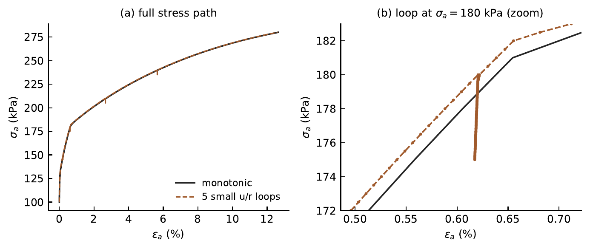

# Overshooting check (Cudny &amp; Truty test)

The [BRICK-vs-ZSoil comparison](hs-mn-bricks-zsoil.md) mixes two things: the BRICK small-strain
mechanism and the choice of failure criterion (Matsuoka&ndash;Nakai here, Mohr&ndash;Coulomb in
the ZSoil reference). This page isolates the BRICK mechanism on its own, within this
implementation, by reproducing Section 5.1 of Cudny &amp; Truty&nbsp;[5] directly: no external
reference curve is needed, since the check is that an interrupted loading path reproduces its own
purely monotonic reference — the same model, the same failure criterion, no mixing.

## Test

Drained triaxial compression of glacial till (parameters of&nbsp;[5], Eq. 44; OCR&nbsp;$=2$):
monotonic axial-stress loading from $-100$ to $-280$&nbsp;kPa, versus the identical path
interrupted by five small axial-stress unloading&ndash;reloading loops
($\Delta\sigma_a = \pm 5$&nbsp;kPa) at $\sigma_a = 120, 150, 180, 210, 240$&nbsp;kPa. If the BRICK
mechanism does not overshoot, both loading histories must arrive at (numerically) the same
stress&ndash;strain state.

<figure class="hsb-fig-wrap" markdown>
{ .hsb-fig }
<figcaption>
(a) Monotonic loading versus the same path interrupted by five small unloading&ndash;reloading
loops: the two curves remain visually coincident, i.e. no overshooting occurs. (b) Detail of the
loop at $\sigma_a = 180$&nbsp;kPa.
</figcaption>
</figure>

The two loading histories are numerically indistinguishable after the loops close: the maximum
deviation over the entire post-loop loading history is $0.28$&nbsp;kPa on $\sigma_a$, i.e.
$0.16\,\%$ of the applied deviatoric stress range — at the numerical-tolerance level, not a
partial or approximate closure.

!!! info "Reproducing this check"
    This is the same test used to validate the implementation in the accompanying software
    publication. The standalone driver and raw output are not currently part of this repository's
    `examples/` folder; ask if you would like them added.
