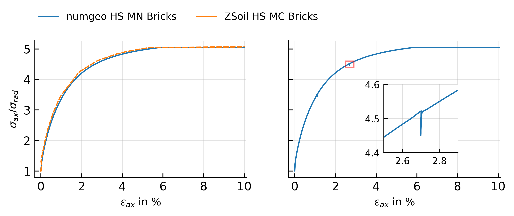

# BRICK extension vs. ZSoil

Validating the BRICK small-strain extension itself is harder than validating the base model: the
only other publicly documented implementation of the BRICK extension is Cudny &amp;
Truty's&nbsp;[5] own, in ZSoil, which pairs it with a **Mohr&ndash;Coulomb** failure criterion.
This implementation uses **Matsuoka&ndash;Nakai** instead, so some differences from the ZSoil
reference are expected even where the BRICK mechanics themselves agree.

This example uses the same parameter set as
[Base model vs. Benz (2007)](hs-mn-benz.md), but with the documented $\gamma_{0.7}$ value —
i.e. the BRICK extension **activated** — for a drained triaxial compression test with a small
unloading&ndash;reloading loop, compared against the published ZSoil HS-MC-Bricks reference
result of Cudny &amp; Truty&nbsp;[5] / Obrzud &amp; Truty&nbsp;[7].

## Result

<figure class="hsb-fig-wrap" markdown>
{ .hsb-fig }
<figcaption>
Drained triaxial compression, glacial till parameters: this implementation
(Matsuoka&ndash;Nakai, left panel) against the published ZSoil HS-MC-Bricks reference result
(Mohr&ndash;Coulomb). The right panel zooms in on the small unloading&ndash;reloading loop.
</figcaption>
</figure>

The two failure criteria coincide exactly on the triaxial compression meridian, so the overall
stress&ndash;strain response agrees closely. Small differences are attributable to the different
failure/cap formulations away from exact coincidence of the two criteria, rather than to the
BRICK mechanism itself, which both implementations share in spirit.

The right panel also demonstrates, within this same comparison, that the BRICK extension does
**not** overshoot: the small unloading&ndash;reloading loop briefly stiffens the response (the
short vertical excursion), and the curve then rejoins the *same* backbone it was on before the
loop, continuing smoothly with no permanent offset or drift. An implementation that overshot —
as the original HSS history-tensor mechanism does, see [Theory](../theory.md) — would instead
show the post-loop curve permanently shifted from the monotonic one.

!!! note "Why this comparison is the harder of the two"
    Because no other openly inspectable Matsuoka&ndash;Nakai implementation of the BRICK
    extension exists to compare against directly, this validation necessarily mixes two things —
    the BRICK small-strain mechanism and the choice of failure criterion. The
    [base-model comparison against Benz](hs-mn-benz.md) isolates the BRICK-independent part of
    the model instead, against a Matsuoka&ndash;Nakai reference.
